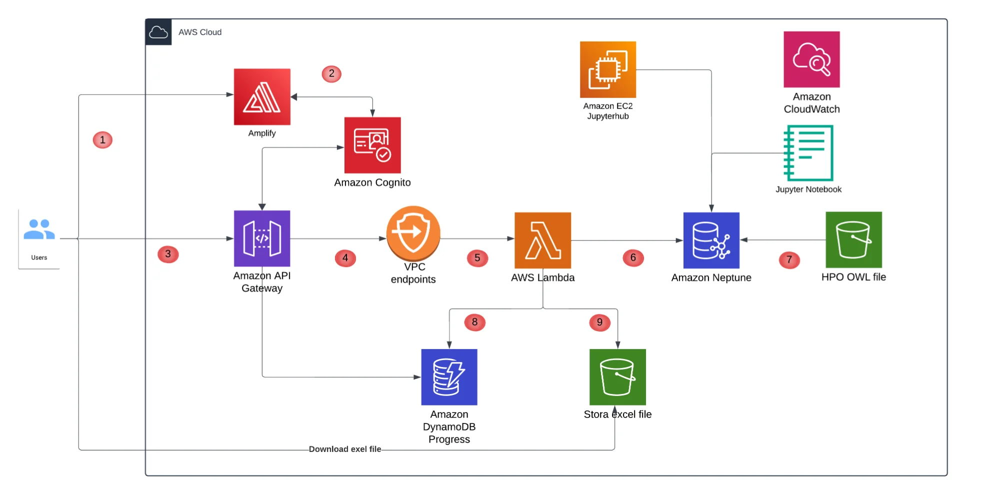

# AWS Serverless Research Portal with Graph Database - 2024

## The Challenge

Research scientists were stuck in a painful workflow: email queries to a database admin, wait 2-3 days for results, repeat. Only 5 researchers could be supported at a time due to manual bottlenecks. Complex graph queries took 15-55 minutes to run, making real-time web APIs impossible.

**The goal:** Build a self-service portal where researchers submit their own queries and get results without waiting days.

## The Solution

I built a fully serverless research portal using Amazon Neptune graph database with an asynchronous query processing pattern. The key insight was decoupling query submission from execution - users submit queries, get a job ID immediately, then check back for results.

### Results That Matter
- **Query turnaround:** 3 days → 15 minutes (99% faster)
- **User capacity:** 5 → 50+ researchers (10x scale)  
- **Admin overhead:** 20h → 2h per week (90% reduction)
- **Monthly cost:** $477 with auto-scaling

## Architecture Overview



### How It Works
1. **User submits query** → React frontend via AWS Amplify
2. **API Gateway + Lambda** → Creates job in DynamoDB (status: PENDING)
3. **Returns job ID** → User gets immediate response (<1 second)
4. **Background processing** → Lambda executes query against Neptune
5. **Results stored** → S3 with pre-signed download URLs
6. **User polls status** → Until COMPLETED, then downloads results

### Core Components

**Frontend & Auth**
- AWS Amplify hosting with CI/CD pipeline
- Amazon Cognito for user authentication (Researchers vs Administrators)
- React interface for query submission and result retrieval

**API & Processing**  
- API Gateway with JWT token validation
- Lambda functions (Python 3.11) for async query processing
- DynamoDB for job status tracking and audit trail

**Data & Storage**
- Amazon Neptune cluster (db.r6g.large + read replica)
- S3 for query results with lifecycle policies
- EC2 Jupyter notebook for data transformation

**Infrastructure**
- VPC with private subnets for security
- CloudWatch for monitoring and alerting
- Terraform for 90% infrastructure automation

## Key Technical Decisions

### 1. Asynchronous Query Pattern
**Problem:** Neptune queries take 15-55 minutes, but API Gateway times out at 29 seconds.

**Solution:** Job-based async pattern with DynamoDB status tracking.
- Eliminates timeout issues completely
- Users can submit multiple queries and check back later
- Complete audit trail of every query
- Better error handling without racing against timeouts

### 2. Neptune vs Traditional Databases
**Why Neptune?** Native graph traversal with O(1) performance per relationship hop. Traditional SQL databases require complex recursive joins that perform poorly with millions of connected data points.

### 3. AWS Amplify for Frontend
**Why not S3 + CloudFront?** Amplify provides built-in Cognito integration, automatic CI/CD from Git, and global CDN without manual configuration.

## Security & Compliance

**Network Security**
- VPC-only Neptune access with security groups
- Private subnets for database and compute resources
- TLS 1.2+ encryption for all communications

**Authentication & Authorization**
- Cognito User Pools with role-based access control
- JWT token validation at API Gateway
- Pre-signed S3 URLs with ownership validation

**Data Protection**
- KMS encryption for Neptune and S3 storage
- Automated data classification and retention policies
- Complete audit logging for compliance

## Performance & Scalability

**Auto-Scaling Strategy**
- Lambda scales to 1000+ concurrent executions automatically
- Neptune read replicas isolate query workload from updates
- DynamoDB on-demand scaling handles variable loads

**Monitoring**
- CloudWatch dashboards for system health
- Automated alerts for failures and performance issues
- Cost monitoring with monthly optimization reviews

## Cost Breakdown
```
Monthly AWS Costs:
Neptune Cluster: $350
Lambda + API Gateway: $45  
S3 + DynamoDB: $47
Amplify + CloudWatch: $35

Total: $477/month
Cost per query: ~$4.77 (100 queries/month)
Cost per user: ~$9.54 (50 active users)
```

## Deployment

**Prerequisites**
- AWS CLI configured
- Terraform 1.5+
- Node.js 18+ for React frontend

**Infrastructure Setup**
- Terraform deployment automated via CI/CD pipeline
- Infrastructure and application deployed together on Git push

## What I Learned

**Game Changers**
1. **Async processing was essential** - No way around Neptune's long query times
2. **AWS managed services reduced complexity** - Neptune, Cognito, and Amplify eliminated custom solutions

**Future Improvements**
- Query result caching for repeated queries
- Query cost estimation for users
- Reserved Lambda concurrency for guaranteed capacity


## The Impact

This solution transformed how researchers interact with complex graph data. What used to be a frustrating, multi-day process became a self-service experience measured in minutes. The 90% reduction in administrative overhead freed up the team to focus on actual research instead of manual query processing.

Most importantly, it scaled the research capacity 10x while maintaining predictable costs and enterprise-grade security.

---

**Tech Stack:** AWS Amplify, Cognito, API Gateway, Lambda, Neptune, DynamoDB, S3, EC2, CloudWatch, Terraform, React
