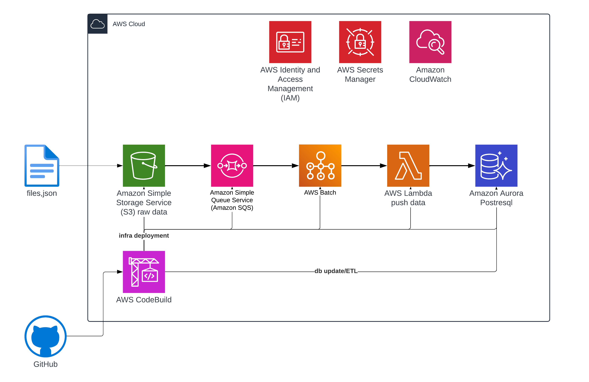

# AWS Lambda File Processing Architecture for High-Frequency S3 Events

## Context

A data analytics company needed to process **100,000 JSON files per day** from multiple data sources. Files arrived unpredictably - sometimes steady, sometimes in massive bursts during business hours. Each file contained structured data that needed to be validated, transformed, and loaded into a PostgreSQL database for analytics.

**The Challenge:**
- **Massive scale:** 100,000 JSON files daily with unpredictable upload patterns
- **Cost explosion:** Direct S3-to-Lambda triggers meant 100,000 separate Lambda invocations per day
- **Performance bottleneck:** Cold starts and individual DB connections were killing throughput
- **Database exhaustion:** RDS connection pool couldn't handle 100,000+ concurrent connections
- **Mixed file types:** S3 bucket received various file types, but only JSON files needed processing
- **Data organization:** Files arrived in different folders, needed intelligent filtering

**Initial Problems:**
- Lambda costs were skyrocketing ($3,000+/month just for invocations)
- Processing lagged hours behind during peak upload times
- Database connection pool exhaustion caused failed transactions
- Non-JSON files triggered unnecessary Lambda invocations

## Architecture

The solution implements **intelligent batch processing** with S3 event filtering and SQS buffering. Instead of triggering Lambda for every file upload, the architecture filters only JSON files from specific folders, batches them efficiently, and processes 100 files at once.

**Core Design Principles:**
1. **Filter at the source** - S3 event notifications filter by folder prefix and `.json` extension
2. **Batch everything** - SQS accumulates events, Lambda processes in batches of 100
3. **Single database connection** - One Lambda invocation handles 100 inserts with one connection
4. **Fail gracefully** - Dead Letter Queue captures failures, doesn't block other files

### Architecture Diagram



### Key Architecture Decisions

#### 1. **S3 Event Filtering → SQS (Critical for Cost Control)**

**Why filtering at S3 is essential:**
- Bucket receives mixed file types: JSON, CSV, TXT, images, logs
- Only JSON files need processing - everything else should be ignored
- Files organized in folders: `/input/orders/`, `/input/customers/`, `/archive/`
- Without filtering, Lambda would trigger for ALL file uploads (wasting money)

**S3 Event Configuration with Filtering:**
```yaml
S3 Event Notification:
  Event Type: s3:ObjectCreated:*
  Filter Rules:
    - Prefix: "input/"           # Only files in /input/ folder
    - Suffix: ".json"             # Only .json extension
  Destination: SQS Queue (dbdata)
```

**Impact of filtering:**
- Before filtering: 500,000 events/day (all file types)
- After filtering: 100,000 events/day (JSON only)
- **80% reduction in unnecessary SQS messages and Lambda triggers**

**Why SQS buffering after filtering?**
- **Cost reduction:** One Lambda invocation processes 100 filtered JSON files instead of 100 separate invocations
- **Reliability:** SQS guarantees delivery with 4-day retention - no lost files
- **Backpressure handling:** If Lambda can't keep up, SQS buffers events safely
- **Retry mechanism:** Failed batches automatically retry with Dead Letter Queue backup

#### 2. **SQS Queue Configuration**

**Queue Settings:**
```yaml
Queue Name: dbdata
Message Retention: 4 days (345,600 seconds)
Visibility Timeout: 120 seconds
Receive Message Wait Time: 20 seconds (long polling enabled)
Maximum Message Size: 256 KB
Dead Letter Queue: dbdata-dlq
Max Receive Count: 3
```

**Why these settings?**
- **4-day retention:** Provides time to diagnose and fix issues before messages expire
- **120s visibility timeout:** Matches Lambda timeout to prevent duplicate processing
- **Long polling:** Reduces empty receives and API costs
- **DLQ after 3 attempts:** Captures persistently failing messages for investigation

#### 3. **Lambda Batch Processing Configuration**

**Event Source Mapping:**
```yaml
Event Source: SQS (dbdata)
Batch Size: 100 messages
Maximum Batching Window: 55 seconds
Function Timeout: 120 seconds
Concurrent Executions: 10 (reserved)
Memory: 512 MB
Runtime: Python 3.11
```

**Why batch processing?**
- **Reduced invocations:** 100 files = 1 invocation (vs. 100 invocations)
- **Database efficiency:** One connection handles 100 inserts instead of 100 connections
- **Cost savings:** ~99% reduction in Lambda invocation costs
- **Better resource utilization:** Amortize cold start overhead across 100 files

**How batching works:**
1. Lambda polls SQS for messages
2. Waits up to 55 seconds to collect 100 messages
3. If 100 messages arrive before 55s, triggers immediately
4. If 55s elapses with fewer messages, processes whatever is available
5. Processes entire batch in single invocation


#### 4. **GitHub Actions + AWS CodeBuild (CI/CD Pipeline)**

**Why CI/CD for data pipeline infrastructure?**
- Database schema changes need version control and automated deployment
- Infrastructure updates (Lambda code, SQS config) should be tested and deployed consistently
- Daily ETL transformations via dbt need scheduled execution
- Manual deployments create inconsistency and risk

**Architecture Pattern:**
```
GitHub Repository
    ├── .github/workflows/
    │   ├── deploy-infra.yml       # Deploy Lambda, SQS, S3 configs
    │   ├── database-schema.yml    # Create/update PostgreSQL schema
    │   └── dbt-daily-run.yml      # Daily ETL transformations
    │
    └── Triggers AWS CodeBuild (runs inside AWS VPC with database access)
```

**GitHub Actions triggers AWS CodeBuild** for operations requiring:
- VPC access to private RDS database
- AWS credentials with elevated permissions
- Larger compute resources than GitHub runners
- Direct network connectivity to AWS services

**Three Automated Workflows:**

**1. Infrastructure Deployment**

- Triggered: On push to main branch
- Purpose: Deploy Lambda functions, update SQS configuration, S3 event rules


**CodeBuild Project:**
- Runs in VPC with access to Lambda, S3, SQS
- Deploys Lambda function code updates
- Updates SQS batch size, timeout configurations
- Modifies S3 event notification filters if needed
- Runs smoke tests to verify deployment

**2. Database Schema Management**

- Triggered: On push to database migration files
- Purpose: Create tables, indexes, update schema versions
- Database Schema Update

**CodeBuild Project: db migration**
- Runs **inside VPC** with direct access to Aurora PostgreSQL
- Retrieves database credentials from Secrets Manager
- Applies schema migrations using tools like Flyway
- Creates/updates tables, indexes, constraints
- Validates schema changes against production data
- Rolls back on failure

**CodeBuild Project:  dbt transformations on processed data**
- Runs **inside VPC** with Aurora database access
- Executes dbt models for data transformations
- Aggregates daily metrics

**Why CodeBuild Instead of GitHub Actions Runners?**

| Requirement | GitHub Runner | AWS CodeBuild |
|-------------|---------------|---------------|
| VPC Access to RDS | ❌ No | ✅ Yes |
| AWS IAM Role Access | Limited | Full control |
| Database Connectivity | Public endpoint only | Private subnet access |
| Compute Resources | Fixed | Configurable |
| Cost for Long Runs | GitHub minutes quota | Pay per build minute |
| Security Group Rules | External IP needed | Internal VPC traffic |


**Benefits of this CI/CD approach:**
- **Version controlled infrastructure** - All changes tracked in Git
- **Automated testing** - Schema changes validated before production
- **Consistent deployments** - No manual database updates
- **Audit trail** - Every deployment logged in GitHub and CodeBuild
- **Scheduled ETL** - dbt runs automatically daily without manual intervention - cron
- **Secure database access** - CodeBuild runs in VPC, no public database endpoints needed

#### 5. **AWS Secrets Manager**

**Why Secrets Manager?**
- No hardcoded credentials in Lambda code
- Automatic credential rotation support
- Encrypted at rest and in transit
- Audit trail via CloudTrail

## Results

### Performance Improvements

**Direct S3 → Lambda, no filterin:**
- Lambda Invocations: 100,000/day (one per JSON file)
- Database Connections: 100,000 connections/day (pool exhaustion)
- Monthly Cost: $3,200 (Lambda $2,800 + RDS $400)
- Failure Rate: 8-12% (connection timeouts during peak hours)

**S3 filtering → SQS → Lambda batch processing:**
- Lambda Invocations: 1,000/day (100 files per batch)
- Average Processing Time: 0.6 seconds/file (amortized across batch)
- Database Connections: 1,000 connections/day (well within limits)
- Monthly Cost: $520 (Lambda $90 + RDS $420 + SQS $10)
- Failure Rate: <0.5% (robust error handling, DLQ capture)

### Key Metrics

| Metric | Direct S3 → Lambda, no filterin | S3 filtering → SQS → Lambda batch processing | Improvement |
|--------|--------|-------|-------------|
| Lambda Invocations | 100,000/day | 1,000/day | **99% reduction** |
| Processing Time/File | 4.2s | 0.6s | **86% faster** |
| Monthly Cost | $3,200 | $520 | **84% savings** ($2,680/month saved) |
| DB Connections | 100,000/day | 1,000/day | **99% reduction** |
| Failure Rate | 8-12% | <0.5% | **95% more reliable** |
| Processing Lag | 6 hours | <2 minutes | **Real-time processing** |


## Lessons Learned

### What Worked Well

1. **S3 event filtering saved massive costs**
   - Simple configuration change with huge impact

2. **Batch processing transformed economics at scale**
   - At 100K files/day, batch processing is non-negotiable
   - Reduced Lambda invocations from 100K to 1K per day (99% reduction)
   - Single database connection per batch eliminated connection pool exhaustion
   - Cold start overhead amortized across 100 files instead of paid per file

3. **SQS as intelligent buffer**
   - Naturally handled traffic spikes (10K files uploaded in 1 hour)
   - Built-in retry with DLQ meant zero data loss
   - 4-day retention gave time to fix issues before messages expired
   - Decoupled upload speed from processing speed

4. **GitHub Actions + CodeBuild for CI/CD**
   - GitHub Actions orchestrates deployment workflows
   - CodeBuild executes inside VPC with database access
   - Automated database migrations prevent manual SQL execution
   - Daily dbt runs ensure consistent ETL without manual triggers
   - Version control for all infrastructure and schema changes

5. **Secrets Manager integration is production-ready**
   - Zero hardcoded credentials in code or CI/CD pipelines
   - CodeBuild retrieves credentials at runtime securely

### What I'd Do Differently


 **Tune batch size based on file size, not just count**
   - Started with batch size of 10 (too small)
   - Moved to 100 (sweet spot for average 50KB JSON files)
   - For larger files (500KB+), might need smaller batches to avoid timeout
   - Should dynamically adjust based on average file size monitoring


## Conclusion

This architecture demonstrates how **thoughtful filtering and batch processing** can transform an expensive, failing system into a cost-effective, reliable solution at scale.

Processing 100,000 files per day seemed daunting with a per-file approach. By implementing two key architectural decisions - **S3 event filtering** and **SQS batch processing** - we achieved dramatic improvements.


**Key Architectural Insights:**

1. **Filter at the source** - S3 event filtering by prefix and suffix eliminated 80% of noise before it even entered the system

2. **Batch relentlessly** - At high event volumes, individual processing is economically impossible. Batching isn't optimization, it's requirement.

3. **Decouple with queues** - SQS absorbed traffic spikes, allowed Lambda to process at sustainable rate, prevented cascading failures

4. **Automate deployments** - GitHub Actions + CodeBuild CI/CD pipeline ensures database schema, infrastructure, and ETL jobs deploy consistently without manual intervention

5. **Secure by default** - Secrets Manager, IAM least privilege, VPC private database access, encryption at rest - security built into architecture, not bolted on

This architecture scales effortlessly from 100K to 1M+ files per day by simply adjusting batch size and Lambda concurrency. The economics improve further at higher scales.

---

**Tech Stack:** Amazon S3, Amazon SQS, AWS Lambda (Python 3.11), Amazon Aurora PostgreSQL, AWS Secrets Manager, CloudWatch, AWS CodeBuild, GitHub Actions, dbt
